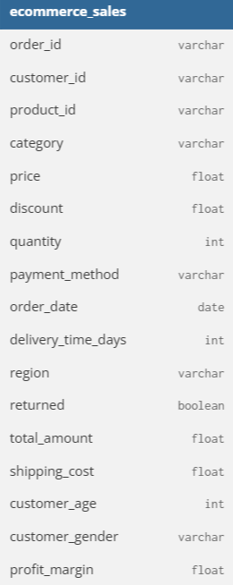
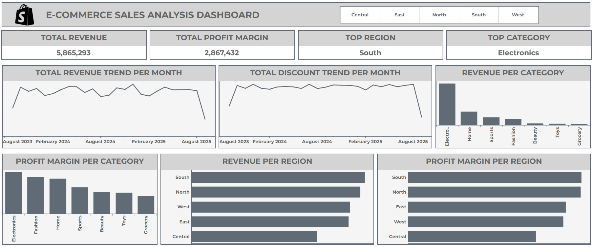
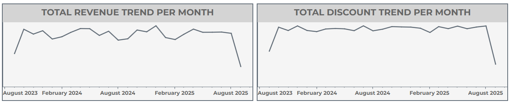

# Project Background

E-commerce sales performance is influenced by multiple factors, including product pricing, discount strategies, customer demand, and shipping costs. Initial observations indicate that the Electronics category generates the highest revenue and profit margins, while Groceries show the weakest performance. From a regional perspective, the South region performs the strongest, whereas the Central region contributes the least.

This project aims to conduct a detailed sales performance analysis to identify the key drivers of profitability across product categories, regions, and time periods, and to provide actionable business insights based on the findings.

An interactive Tableau dashboard used to report can be found [here](https://public.tableau.com/app/profile/faqih.elwidad/viz/E-commerceSalesAnalysis_17646472703710/Dashboard1#1).

# Data Structure & Initial Checks

The dataset consists of a single transactional table containing order-level, product, customer, pricing, and regional information. Initial checks were conducted to ensure data completeness, consistency, and suitability for analysis.

# Executive Summary

This analysis evaluates e-commerce sales performance across categories, regions, and seasonal trends. The results show that Electronics consistently delivers the highest revenue and profit margins, while sales peak in December due to increased order volume and discount activity. Regionally, the South emerges as the strongest contributor, driven by the highest number of orders.

# Insights Deep Dive

### Seasonal Sales Trends

- Revenue consistently increases in **December**, driven by the highest transaction volume of the year.

- Higher discount levels during December stimulate customer purchases and significantly boost sales quantity.

- Sales tend to decline at the beginning of the year, indicating a strong seasonal demand pattern.

### Product Category Performance

- Electronics is the highest-performing category in terms of both revenue and profit margin.

- Higher average prices and strong customer demand contribute to the profitability of the Electronics category.

- Groceries represent the lowest-performing category, indicating potential issues in pricing, margins, or demand.

### Regional Performance

- The South region generates the highest revenue and profit margin among all regions.

- Strong regional performance is driven primarily by the highest number of customer orders.

- The Central region underperforms compared to other regions and requires further evaluation.

# Recommendations

- Avoid relying solely on large year-end discount campaigns. Introduce targeted promotional strategies at the beginning of the year to mitigate seasonal revenue declines.

- Maintain and enhance existing strategies for high-performing categories, particularly Electronics, to sustain profitability.

- Conduct a comprehensive review of marketing, pricing, and cost structures for low-performing categories such as Groceries.

- Prioritize investment and optimization efforts in high-performing regions, while performing in-depth analysis to improve results in underperforming areas.

# Assumptions and Caveats

- The analysis is based solely on historical transaction data and does not incorporate external factors such as marketing campaigns, economic conditions, or competitor actions.

